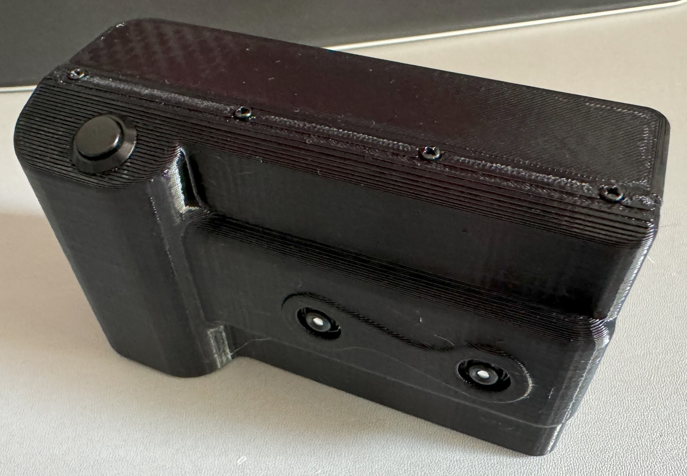
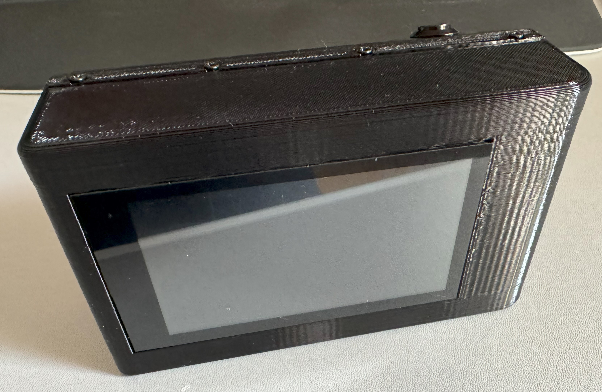

# Wigglegram Camera

Turn stereoscopic images into a wigglegram.

🧪 This is experimental 🧪

## 😍 What it is

🧪 Python software to capture wigglegrams using multiple cameras
🧪 Software synchronized Raspberry Pi camera modules, using picamera2  
🧪 3d printed enclosure  
🧪 Creating smooth videos from just two images using frame interpolation AI algorithms  
